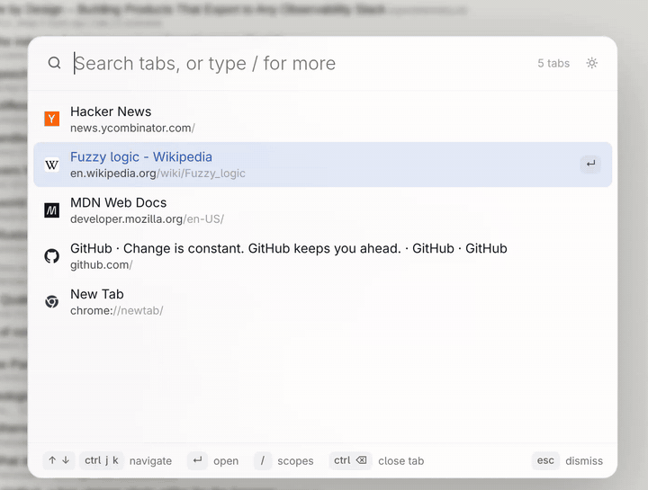

# TabNow

Fuzzy search across every open tab in every window. Press `Alt+F`, type, hit Enter.



## Features

- Searches all windows. Most recently used first, with the previous tab preselected, so `Alt+F` then `Enter` flips back.
- Fuzzy matching ranks domain over title over the rest of the URL.
- Tabs from other windows carry an "other window" badge.
- Close tabs straight from the list.
- No network requests. Nothing leaves your browser.
- Light and dark.

## Install

Not in the Web Store yet.

1. Clone this repo.
2. Open `brave://extensions` (or `chrome://extensions`) and turn on Developer mode.
3. Load unpacked, pick the `extension/` folder.

## Use

Press `Alt+F` or click the toolbar button. TabNow opens as a centered overlay on the current page.

| Key | Action |
| --- | --- |
| `↑` / `↓`, `Ctrl+J` / `Ctrl+K` | Move selection |
| `Enter` | Switch to tab |
| `Ctrl+U` | Clear query |
| `Ctrl+Backspace` | Close selected tab |
| `Esc` | Dismiss |

`Ctrl+N` / `Ctrl+P` are reserved by the browser and can't be used.

## Configure

Change the shortcut at `brave://extensions/shortcuts` (or `chrome://extensions/shortcuts`), row "Activate the extension".

Restricted pages (`brave://`, new tab, Web Store) can't host the overlay, so a small popup window opens instead.
On tiling window managers, add a float rule for it. Hyprland example (classic `hyprland.conf` syntax, which varies by Hyprland version):

```
windowrule = float, center, size 640 480, title:^(TabNow.*)$
```

## Development

Plain JS, no build, no dependencies. Run the matcher tests with:

```
node fuzzy.test.mjs
```
