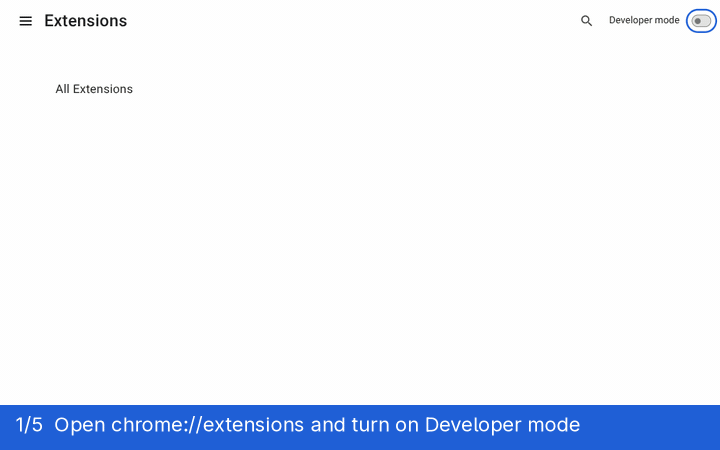
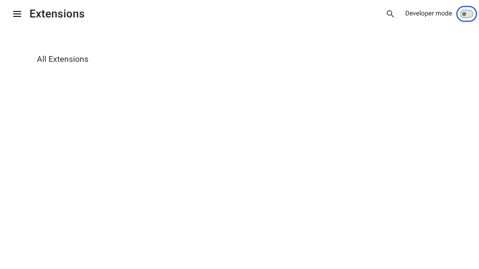
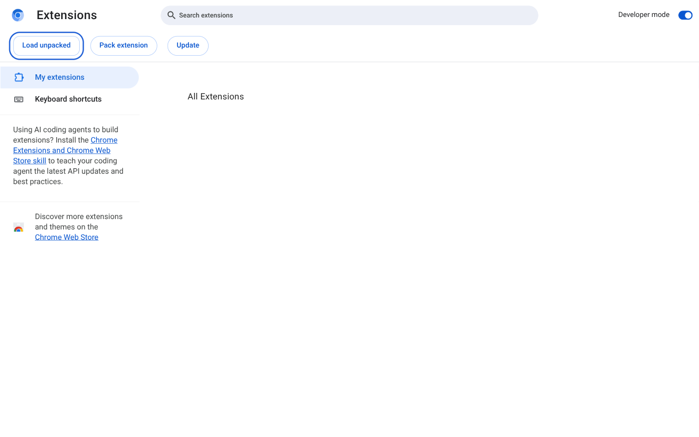
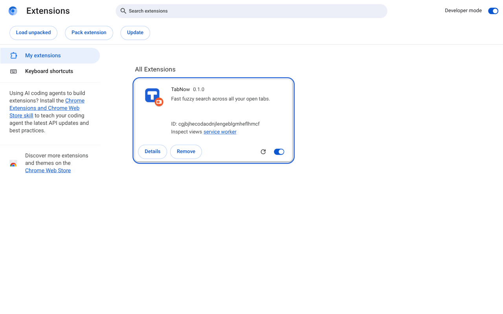
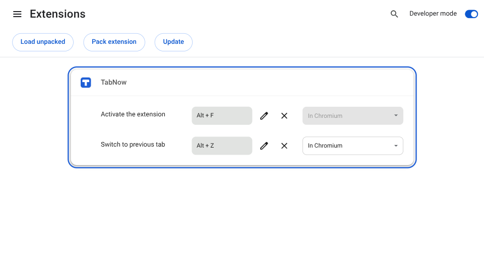
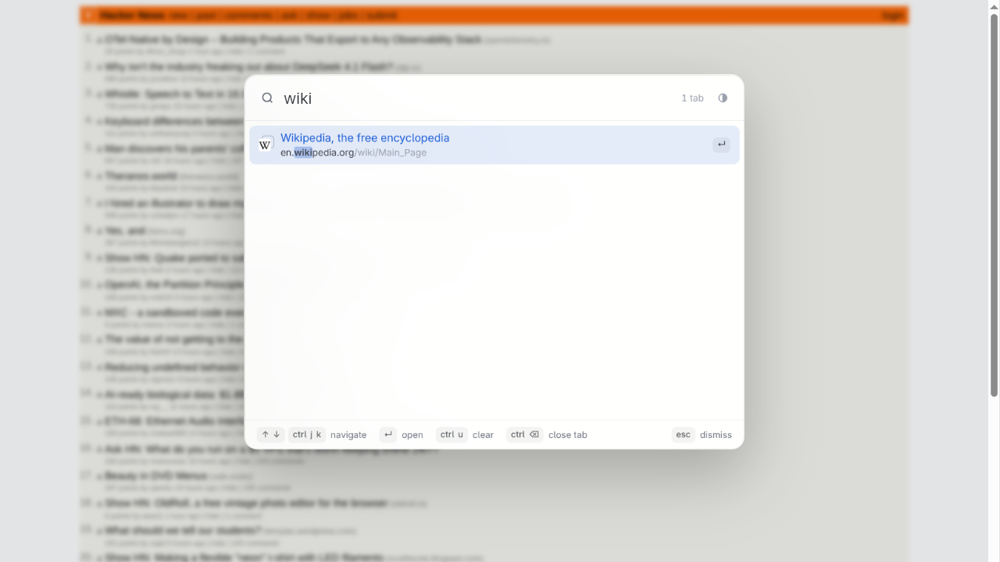
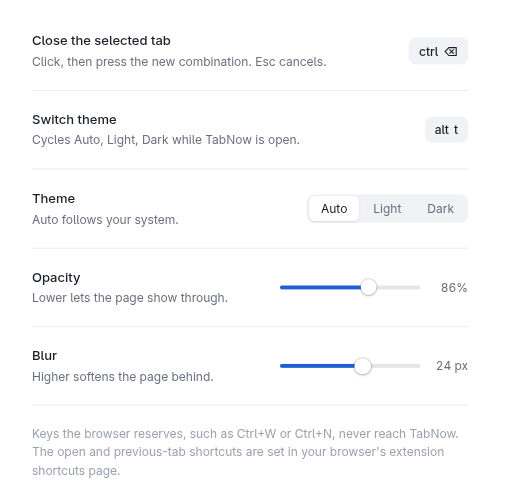

# TabNow

Fuzzy search across every open tab in every window. Press `Alt+F`, type, hit Enter.


## Features

- Searches all windows. Most recently used first, with the previous tab preselected, so `Alt+F` then `Enter` flips back.
- Fuzzy matching ranks domain over title over the rest of the URL.
- Tabs from other windows show a faint second card behind their favicon (hover it for "In another window").
- Optionally searches history and bookmarks too (off by default), listed below the open tabs.
- Close tabs straight from the list.
- No network requests. Nothing leaves your browser.
- Light and dark.

## Install

Not in the Web Store yet. TabNow needs Chrome 121+ or another Chromium browser of that version (Edge, Brave, Opera, Vivaldi, Arc).



<table><tr>
<td align="center"><a href="docs/install/1-developer-mode.png"></a><br><sub>1. Developer mode</sub></td>
<td align="center"><a href="docs/install/2-load-unpacked.png"></a><br><sub>2. Load unpacked</sub></td>
<td align="center"><a href="docs/install/3-loaded.png"></a><br><sub>3. Loaded</sub></td>
<td align="center"><a href="docs/install/4-shortcuts.png"></a><br><sub>4. Shortcuts</sub></td>
<td align="center"><a href="docs/install/5-search.png"></a><br><sub>5. Search</sub></td>
<td align="center"><a href="docs/install/6-options.png"></a><br><sub>Options</sub></td>
</tr></table>

1. Clone this repo.
2. Open `brave://extensions` (or `chrome://extensions`) and turn on Developer mode.
3. Click Load unpacked, pick the `extension/` folder.
4. Optional: check the shortcuts at `chrome://extensions/shortcuts`, then press `Alt+F` on any page.

`brave://` and `edge://` pages work the same as `chrome://`.

## Keyboard shortcuts

Open TabNow with `Alt+F` or the toolbar button. It shows as a centered overlay on the current page. Pressing `Alt+F` again while it is open closes it.

On open, tabs are listed most recently used first and the previous tab is preselected.

**Navigate**

| Key | What it does |
| --- | --- |
| <kbd>↑</kbd> / <kbd>↓</kbd> | Move the selection. Wraps around at both ends. |
| <kbd>Ctrl</kbd>+<kbd>J</kbd> / <kbd>Ctrl</kbd>+<kbd>K</kbd> | Same, vim-style (down / up). |
| Mouse | Hover selects a row, click switches to it. |

**Act**

| Key | What it does |
| --- | --- |
| <kbd>Enter</kbd> | Switch to the selected tab. Focuses its window if it is in another one. |
| <kbd>Ctrl</kbd>+<kbd>Backspace</kbd> (<kbd>Cmd</kbd>+<kbd>Backspace</kbd> on macOS) | Close the selected tab and stay in the list. Change the key on the options page. |
| <kbd>Esc</kbd> | Dismiss. Clicking the dimmed background does the same. |

**Search**

| Key | What it does |
| --- | --- |
| Type | Space-separated words must all match. Matches in the domain rank above the title, the title above the rest of the URL. |
| <kbd>/</kbd> | Pick what to search. A menu lists `/t` Tabs, `/b` Bookmarks, `/h` History (type letters to filter, <kbd>↑</kbd> <kbd>↓</kbd> then <kbd>Enter</kbd> or <kbd>Tab</kbd> to pick). `/b ` with a space locks it directly. The scope shows as a chip before the field; <kbd>Backspace</kbd> on an empty field removes it. Bookmarks and history need the option on the options page. |
| <kbd>Ctrl</kbd>+<kbd>U</kbd> | Clear the query and keep the scope. Press again on an empty query to clear the scope. |
| <kbd>Alt</kbd>+<kbd>T</kbd> | Switch theme: Auto → Light → Dark (also the button next to the tab count). Change the key on the options page. |

Tips:

- `Alt+Z` switches straight to your previous tab without opening TabNow, in any window. Press it again to flip back. (`Alt+F`, `Enter` does the same through the list.)
- `Ctrl+N` is not used for moving down: the browser reserves it for "new window" and pages cannot intercept it. Use `Ctrl+J` / `Ctrl+K` instead.

Change the opening shortcut and the `Alt+Z` previous-tab shortcut at `brave://extensions/shortcuts` (or `chrome://extensions/shortcuts`): TabNow, "Activate the extension" and "Switch to previous tab".

## Configure

The close-tab key (default `Ctrl+Backspace`, `Cmd+Backspace` on macOS) is set on the TabNow options page: right-click the toolbar icon → Options, click the key and press the new combination. It syncs with your browser profile.

The same page has an **Opacity** slider (60–100 %, default 86 %): lower lets the page show through the search panel.

A **Blur** slider (off to 40 px, default 24 px) sets how strongly the page behind is blurred.

**Search history and bookmarks** is off by default. Turning it on shows the browser's permission prompt (history and bookmarks); matches then follow the open tabs, bookmarks first, then history of the last 90 days, and open in a new tab.

**Theme** picks Light, Dark or Auto (follows your system).

Restricted pages (`brave://`, new tab, Web Store) can't host the overlay, so a small popup window opens instead.
On tiling window managers, add a float rule for it. Hyprland example (classic `hyprland.conf` syntax, which varies by Hyprland version):

```
windowrule = float, center, size 640 480, title:^(TabNow.*)$
```

## Development

Plain JS, no build, no dependencies. Run the matcher tests with:

```
node fuzzy.test.mjs
```

## License

MIT, see [LICENSE](LICENSE). Made by [GRAN Software Solutions](https://www.gransoftware.de).
